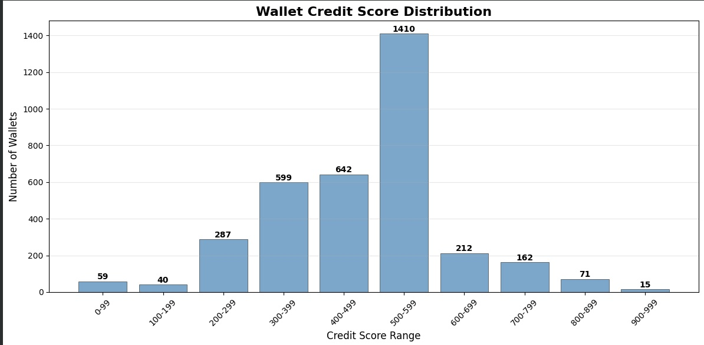

# Comprehensive Analysis of DeFi Wallet Credit Scores

This report presents a full analysis of 3,497 DeFi wallets, scored based on their on-chain transaction history. The scoring model evaluates key behavioral factors to provide a reliable measure of creditworthiness, leading to actionable business insights.

---

## 1. Credit Score Distribution Analysis

This analysis provides an overview of how credit scores are distributed across the wallet population. The majority of wallets (58.7%) fall into the medium-risk (400-599) range, indicating a significant user base of moderately active participants.

### Score Distribution Table

| Score Range | Number of Wallets | Percentage of Total |
|-------------|-------------------|---------------------|
| 0-99        | 59                | 1.7%                |
| 100-199     | 40                | 1.1%                |
| 200-299     | 287               | 8.2%                |
| 300-399     | 599               | 17.1%               |
| 400-499     | 642               | 18.4%               |
| 500-599     | 1,410             | 40.3%               |
| 600-699     | 212               | 6.1%                |
| 700-799     | 162               | 4.6%                |
| 800-899     | 71                | 2.0%                |
| 900-999     | 15                | 0.4%                |

---

## 2. Behavioral Analysis by Score Range

This section details the average on-chain behavior for wallets within each score bracket. Clear trends emerge that validate the scoring model's effectiveness, particularly with `avg_repay_ratio` and `avg_days_active` increasing in line with higher scores.

### Detailed Behavioral Metrics

| score_range | wallet_count | avg_repay_ratio | avg_liquidation_rate | avg_days_active | avg_transactions | avg_deposit_ratio | avg_activity_diversity |
|-------------|--------------|-----------------|----------------------|-----------------|------------------|-------------------|------------------------|
| 0-99        | 59           | 0.000           | 0.013                | 12.932          | 30.678           | 0.000             | 0.281                  |
| 100-199     | 40           | 0.000           | 0.034                | 33.500          | 366.425          | 0.133             | 0.322                  |
| 200-299     | 287          | 0.017           | 0.014                | 15.829          | 12.059           | 0.363             | 0.480                  |
| 300-399     | 599          | 0.048           | 0.003                | 14.591          | 14.382           | 0.589             | 0.612                  |
| 400-499     | 642          | 0.132           | 0.002                | 26.322          | 17.927           | 0.754             | 0.398                  |
| 500-599     | 1410         | 0.168           | 0.001                | 11.174          | 11.560           | 0.812             | 0.835                  |
| 600-699     | 212          | 0.974           | 0.002                | 56.514          | 75.991           | 0.360             | 0.181                  |
| 700-799     | 162          | 1.170           | 0.004                | 64.438          | 90.259           | 0.350             | 0.202                  |
| 800-899     | 71           | 1.436           | 0.001                | 97.901          | 146.915          | 0.417             | 0.127                  |
| 900-999     | 15           | 3.611           | 0.001                | 106.400         | 165.733          | 0.626             | 0.066                  |

### Supporting Visualizations

---

## 3. Analysis of High-Scoring vs. Low-Scoring Wallets

A direct comparison of the best and worst-performing wallet cohorts reveals stark differences in behavior, confirming the model's ability to distinguish between reliable users and high-risk profiles.

### High-Scoring Wallets (Score 700+)
- **Number of wallets:** 249
- **Average score:** 788
- **Avg Repay Ratio:** 1.392
- **Avg Liquidation Rate:** 0.003 (Very Low)
- **Avg Days Active:** 76.37
- **Sample Wallet (`0x0214c5c4...`):** Score 999, 135 days active, 1.167 repay ratio, 0 liquidations.

### Low-Scoring Wallets (Score 0-299)
- **Number of wallets:** 381
- **Average score:** 204
- **Avg Repay Ratio:** 0.012
- **Avg Liquidation Rate:** 0.016 (5x higher than high-scorers)
- **Avg Days Active:** 17.13
- **Sample Wallet (`0x004f137c...`):** Score 0, 1 day active, 0 repay ratio, 0 liquidations.

---

## 4. Business Insights and Recommendations

The analysis provides clear, actionable insights for risk management and business strategy by segmenting the wallet population into distinct risk tiers.

### Wallet Risk Segmentation
- **High Risk (0-399):** 976 wallets (27.9%)
- **Medium Risk (400-599):** 2,059 wallets (58.9%)
- **Low Risk (600+):** 462 wallets (13.2%)

### Recommended Actions
1.  **High Risk:** Prioritize these **976 wallets** for manual review or stricter borrowing/lending terms to mitigate default risk.
2.  **Medium Risk:** Apply standard terms to these **2,059 wallets** but monitor for changes in behavior. Consider tiered interest rates.
3.  **Low Risk:** Offer premium terms (e.g., lower fees, higher LTV ratios) to the **462 wallets** to encourage retention and platform growth.

---

## 5. Model Validation Summary

The model's validity is confirmed by the logical correlation between its key input features and the final credit score. Repayment behavior and activity duration are the strongest predictors of a positive score.

### Correlation Values:
- **`repay_ratio`:** 0.371 (Strong positive correlation)
- **`days_active`:** 0.307 (Moderate positive correlation)
- **`liquidation_rate`:** -0.099 (Correct negative correlation)

**Interpretation:**
- As wallets exhibit better repayment habits and longer activity, their credit score increases.
- As liquidation events increase, the score rightly decreases.

This confirms the model is functioning as intended and provides a reliable basis for the business insights generated.
